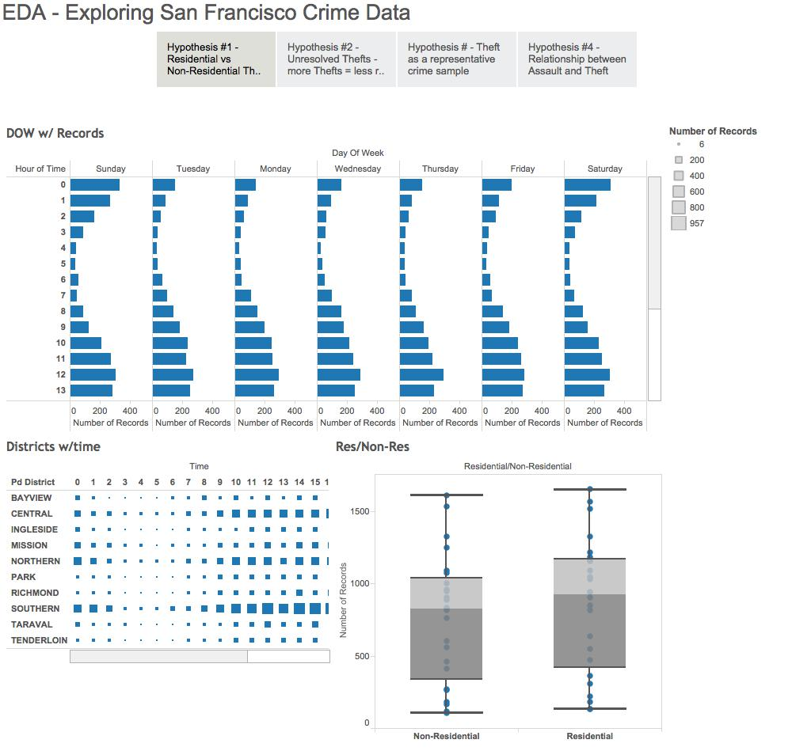
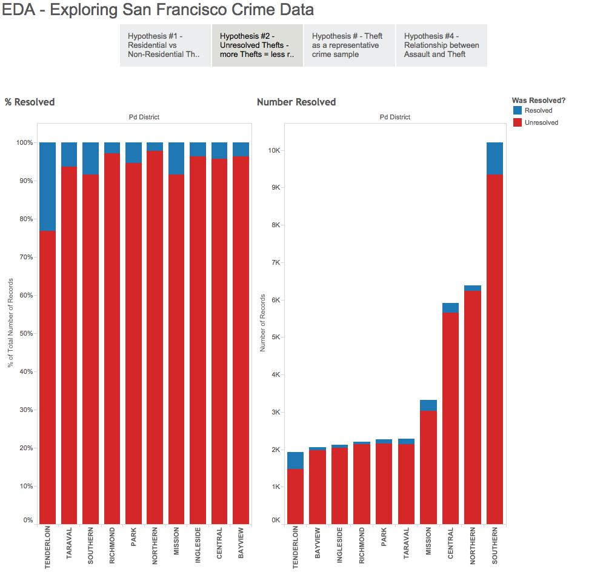
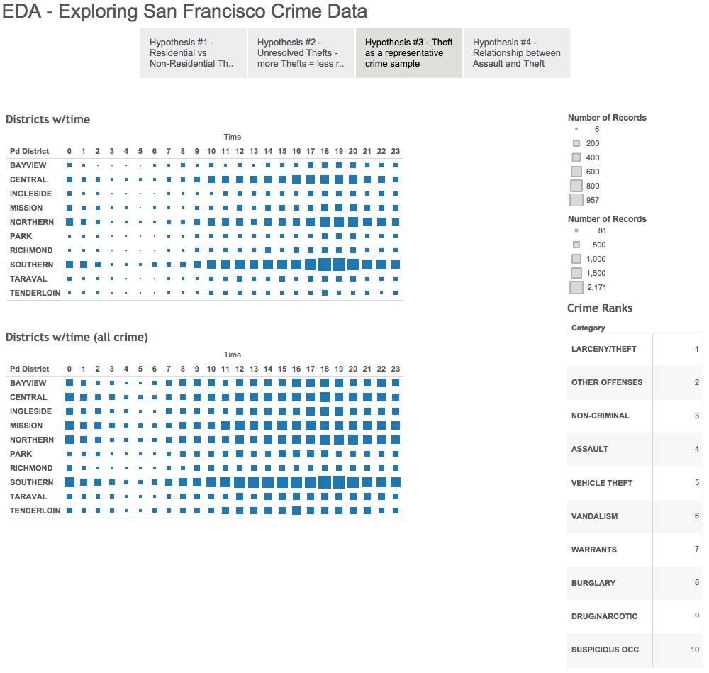
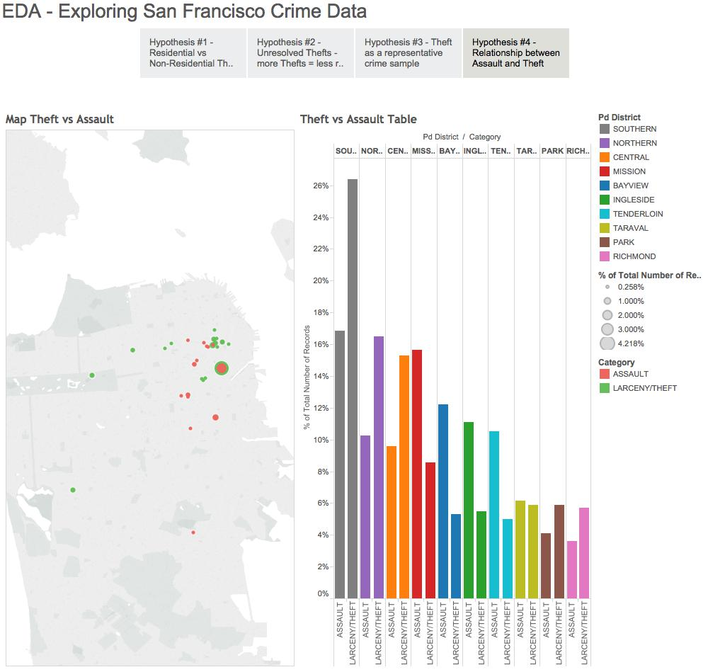

Bill Chambers

Info 247 - EDA

###Data:

The dataset I chose was a data set on [crime in San Francisco.](http://data.sfgov.org/d/tmnf-yvry?category=Public-Safety)

[http://data.sfgov.org/d/tmnf-yvry?category=Public-Safety](http://data.sfgov.org/d/tmnf-yvry?category=Public-Safety)

I have filtered the dataset which is large at 350 mb down to only theft incidents in 2014. I did this by taking that file and running commands:

```sh
egrep "2014" SFPD_Incidents_-_from_1_January_2003.csv > SFPD_2014.csv
egrep "LARCENY/THEFT" SFPD_2014.csv > SFPD_2014_theft.csv
cat col_format.csv SFPD_2014_theft.csv > SFPD_2014_theft_col.csv
```
Dashboards follow each hypothesis.

###Hypotheses:

1. My first hypothesis is that most thefts occur at night in residential neighborhoods. Given that many people have to park their cars outside at night, I assume that most crime occurs when people are asleep.

By looking into this data, I decided that it would likely be more interesting to try and look at it day by day (rather than just cumulatively). We can see that evening time is by far the most likely time that thefts will occur with weekdays frequently around 6PM to 8PM while the weekends see a jump in thefts around midnight as well. Sunday was by far the calmest day - something I might want to look at further along.

After completing that histogram of just dates and times I need to dive deeper into the data and better understand time and certain neighborhoods. 

Then I created a new parameter that is "Residential" and "Non-Residential".

Non-Residential:

- Southern
- Central
- Bayview (kind of)

Residential:

- Mission
- Northern
- Park
- Richmond
- Ingleside
- Taravel
- Tenderloin

I then got the resulting box and whisker plot.

Once I was able to do that I was able to confirm my hypothesis, it seems that more crime occurs in residential neighborhoods than non-residential neighborhoods on any given day of the week. The one important thing to keep in mind is that I used my personal knowledge of the districts (as well as maps from each police station to classify it as residential or non-residential - this is an unofficial classification). In terms of my hypothesis it is not so clear that most crime occurs at "night" - it seems that dusk is the time at which most crime occurs.



2. Given my previous data, I was able to see that the Southern District has the most theft. My hypothesis is that it has the most unresolved crime. I also hypothesize that more crimes are resolved in the richest neighborhoods than in poor neighborhoods. Specifically, I believe that the Richmond and Northern districts have the high proportion of solved crimes per crime committed.

I created a new variable which is the number of thefts resolved. A case is unresolved if the Resolution field is NONE.

This exploration yielded some interesting results and definitely not what I expected. We can see from the percent resolved that nearly 25% of the crimes in the tenderloin are resolved. I think that this might be because it's such a small area, that many people are caught doing relatively petty things and don't end up getting very far from where they committed the crime. Interestingly, the Northern District seemed to have the smallest percentage resolved - yet also had a lot of crime numbers. This fact makes me question my Residential/Non-Residential qualifications from earlier - although they may be valid. Interestingly, the Richmond seems to have a low crime resolution rate as well - not necessarily what I would have expected.

Looking at the resolution field gave me a lot of interesting ideas to explore - what makes a theft something the DA doesn't want to prosecute? Where is the highest number of juvenile bookings? 



Unfortunately I realized that my dataset was a bit constrained when I just focused on thefts. So I loaded in all crimes in 2014 to see what else I might be able to dig up.

```sh
cat col_format.csv SFPD_2014.csv > SFPD_2014_col.csv
```

Gives me all data from 2014.

3. I hypothesize that the theft distribution follows a similar distribution to the general population of crime. By this I mean thefts will be a representative sample from the population - that all crimes will occur roughly in the same locations, at the same times, in the same places, at the same amounts.

By looking at the dashboard - this seems to be roughly true. It seems that they're more or less the same - obviously the totals are throw off but this brought me to a new visual, what are the most common crimes? (ranked on the right side of this dashboard) It's not by any means a perfect representation but it was close enough (visually) that it's fair to say that's it is a relatively accurate representation of where crime occurs in the city.



4. Now that I had a better idea of how the data might be made up - I thought it would be good to jump into a map perspective. I thought looking at assaults might be a good next step - they're the 4th most common category of crime in 2014. I hypothesize that thefts and assaults are related and occur in more or less the same locations. By that I mean that their ratios are the same. If assault occurs as X% of total crime in a given district theft will occur at 2X% of total crime.

I visualized this through 2 mediums. Firstly through a map where I plotted only thefts and assaults at locations that were reported more than 20 times. This gave me a general idea of where thefts and assaults are likely to occur. When we filter out the incidents that occur at locations only one or two times. When we take a look at this we can immediately see that some hotspots are shared and some are different. Assaults clearly occur in the Mission much more than thefts. What's interesting when we use the map view is that we can see these differences much more quickly (in relation to where in the city they are likely to occur). I noticed immediately that there seems to be a fair amount of theft in a specific location in Golden Gate Park. Definitely worth thinking about and exploring further.

Looking at the table tells an even more interesting story. I've done some working to basically look at the percent of total crime in a given district - we can see that in the Mission - theft is not as common as assault. What does this mean? In SOMA there seems to be a lot more theft, possibly from tourists while in the Mission it seems that more fights may be breaking out leading to assaults instead of thefts.

Quite simply, I could reject my hypothesis - there seems to be no relation between theft occurring at a certain percent more across the city.


